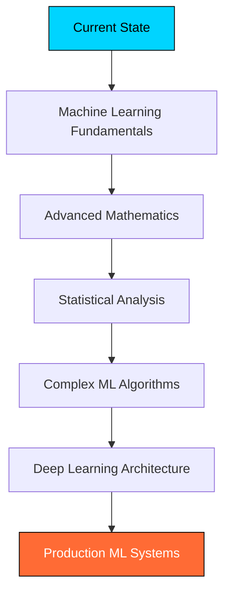

<div align="center">

# 🚀 Full Stack Developer & Cloud Architect


</div>

## 🧠 **Professional Overview**

```javascript
const developer = {
    name: "Professional Developer",
    location: "Building the Future",
    focus: ["Full Stack Development", "Cloud Architecture", "AI Integration"],
    experience: "Production-Ready Applications",
    mindset: "Scale First. Optimize Always."
};
```


## ⚡ **Core Competencies**

<div align="center">

### **Frontend Development**


### **Backend & APIs**


### **Databases**


### **Cloud & DevOps**


### **AI & Machine Learning**


</div>


## 🏗️ **Architecture Expertise**

<div align="center">

| **Domain** | **Technologies** | **Implementation** |
|------------|------------------|-------------------|
| **Microservices** | Spring Boot • Spring Cloud • Docker | Production Grade Architecture |
| **API Development** | REST APIs • GraphQL • Authentication | Scalable Backend Systems |
| **Cloud Infrastructure** | AWS EC2 • S3 • RDS • ECS • Route53 | High Availability Deployment |
| **AI Integration** | OpenAI • LangChain • Vector Databases | Intelligent Application Features |
| **Database Design** | PostgreSQL • MongoDB • Optimization | Performance Focused Solutions |
| **DevOps Pipeline** | GitHub Actions • Docker • CI/CD | Automated Deployment Workflows |

</div>


## 📊 **Performance Metrics**

<div align="center">


</div>

<div align="center">


</div>


## 🎯 **Future Development Goals**

<div align="center">



</div>

**Advanced Learning Path:**
- 🔬 **Machine Learning Foundations** - Mathematical principles and algorithmic understanding
- 📐 **Advanced Mathematics** - Linear algebra calculus and statistical methods
- 📊 **Statistical Analysis** - Probability theory and data science methodologies  
- 🤖 **Complex Machine Learning** - Neural networks and deep learning frameworks
- 🧠 **Artificial Intelligence** - Advanced pattern recognition and predictive modeling


## 🛠️ **Development Environment**

<div align="center">


**Tools:** IntelliJ IDEA • VS Code • Postman • Docker Desktop • AWS CLI

</div>


## 🌐 **Connect & Collaborate**

<div align="center">

[](https://linkedin.com/in/yourprofile)
[](https://twitter.com/yourhandle)
[](https://yourportfolio.com)
[](mailto:your.email@domain.com)

</div>


## 💡 **Development Philosophy**

<div align="center">

> **"Build systems that scale. Write code that lasts. Ship products that matter."**

</div>

<div align="center">

```ascii
╔══════════════════════════════════════════════════════════════╗
║  🚀 Production Ready  •  ⚡ Performance Focused  •  🔧 Scalable ║
╚══════════════════════════════════════════════════════════════╝
```

</div>


## 🎨 **Activity Graph**

<div align="center">


</div>


## 🏆 **GitHub Trophies**

<div align="center">


</div>

---

<div align="center">

### 🔥 **Ready to Build Something Extraordinary?**


**Contact for collaboration on high-impact projects**

</div>


